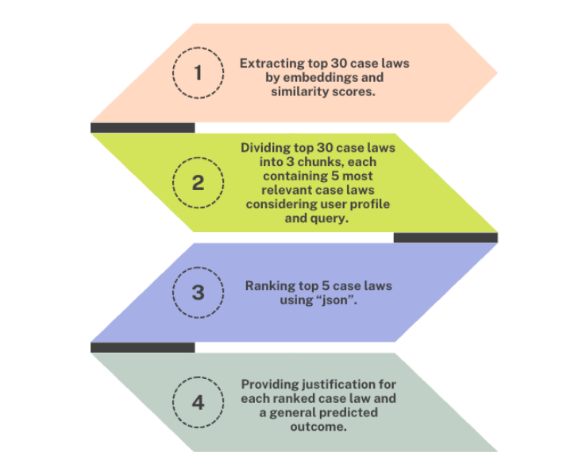
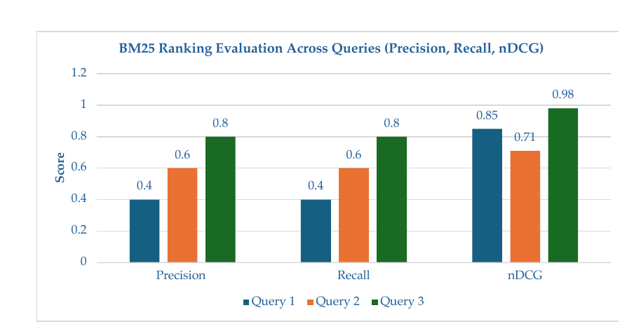
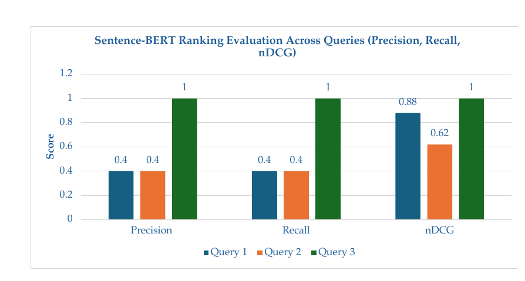
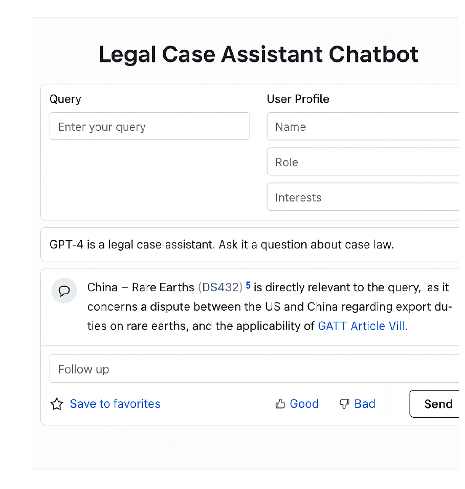

# Personalised Legal Document Search in International Law

**MSc Data Science thesis research prototype by Madiha Ahmadi**

This project investigates how traditional information retrieval and large language models can support personalised search across international-law documents. It uses a dataset of **111 World Trade Organization (WTO) dispute summaries** and compares keyword retrieval, semantic retrieval, and LLM-assisted re-ranking.

> This repository contains the research and notebook prototype developed for the thesis. The chatbot interface shown below was proposed as future work and was not deployed as part of the original implementation.

<p align="center">
  
</p>

## Project links

- [Read the full MSc thesis](docs/MSc_Data_Science_Thesis_Madiha_Ahmadi.pdf)
- [View the thesis presentation](https://prezi.com/view/RXnhjZNaHcL2pm5eLXGM/?referral_token=R5rDz-lnB3FN)
- [View the numbered notebooks](notebooks/)

## Research objective

The project explores two questions:

1. How effectively can traditional and semantic information-retrieval methods rank international legal documents?
2. How can an LLM use a query and user profile to provide personalised re-ranking, relevance explanations, and a predicted outcome?

## What the project demonstrates

- PDF data extraction with `pdfplumber`
- Dataset cleaning and validation with `pandas`
- Legal-text normalisation, tokenisation, stop-word removal, and lemmatisation
- Keyword retrieval using BM25
- Semantic retrieval using Sentence-BERT
- Ranking evaluation using Precision@5, Recall@5, and nDCG@5
- Embedding-based candidate selection
- LLM-assisted personalised re-ranking and natural-language explanations
- Secure API-key handling through environment variables

## Technology stack

`Python` · `Jupyter Notebook` · `pandas` · `NumPy` · `pdfplumber` · `NLTK` · `spaCy` · `rank-bm25` · `sentence-transformers` · `scikit-learn` · `OpenAI API`

## Methodology

The original workflow was:

1. Extract seven fields from WTO dispute-summary PDFs: Case ID, Title, Complainant, Respondent, Date, Articles, and Summary.
2. Identify missing and duplicate values and conduct second-pass extraction where necessary.
3. Preprocess legal text through normalisation, tokenisation, stop-word removal, lemmatisation, sentence segmentation, and embedding generation.
4. Run BM25 and Sentence-BERT retrieval for three user-oriented legal queries.
5. Evaluate ranking quality against manually defined expert relevance judgements.
6. Use embeddings to shortlist the top 30 cases.
7. Divide the shortlist into chunks, use an LLM to select candidates, and produce a final top-five ranking with explanations and a predicted outcome.

## Baseline evaluation results

The reported thesis results for the three evaluation queries were:

| Model | Query | Precision@5 | Recall@5 | nDCG@5 |
|---|---:|---:|---:|---:|
| BM25 | 1 | 0.40 | 0.40 | 0.85 |
| BM25 | 2 | 0.60 | 0.60 | 0.71 |
| BM25 | 3 | 0.80 | 0.80 | 0.98 |
| Sentence-BERT | 1 | 0.40 | 0.40 | 0.88 |
| Sentence-BERT | 2 | 0.40 | 0.40 | 0.62 |
| Sentence-BERT | 3 | 1.00 | 1.00 | 1.00 |

<p align="center">
  
</p>

<p align="center">
  
</p>

These results are based on three test queries and manually defined relevance sets, so they should be interpreted as a small-scale research evaluation rather than a general benchmark.

## Notebook guide

| Notebook | Purpose |
|---|---|
| [`01_dataset_creation.ipynb`](notebooks/01_dataset_creation.ipynb) | Extracts structured data from WTO summary PDFs |
| [`02_data_cleaning.ipynb`](notebooks/02_data_cleaning.ipynb) | Checks missing values and duplicates and performs second-pass extraction |
| [`03_data_preprocessing.ipynb`](notebooks/03_data_preprocessing.ipynb) | Normalises text, tokenises, lemmatises, segments, and generates embeddings |
| [`04_bm25_retrieval.ipynb`](notebooks/04_bm25_retrieval.ipynb) | Runs and evaluates keyword-based retrieval |
| [`05_sbert_retrieval.ipynb`](notebooks/05_sbert_retrieval.ipynb) | Runs and evaluates semantic retrieval |
| [`06_llm_personalised_reranking.ipynb`](notebooks/06_llm_personalised_reranking.ipynb) | Shortlists, re-ranks, explains, and evaluates personalised results |

The notebooks retain selected outputs from the original thesis implementation so that visitors can inspect the results without rerunning every API-dependent cell.

## Repository structure

```text
personalised-legal-document-search/
├── assets/
│   ├── bm25_evaluation.png
│   ├── chatbot_concept.png
│   ├── llm_pipeline.png
│   └── sbert_evaluation.png
├── data/
│   ├── raw/
│   │   └── wto_case_pdfs/
│   ├── processed/
│   └── README.md
├── docs/
│   └── MSc_Data_Science_Thesis_Madiha_Ahmadi.pdf
├── notebooks/
│   ├── 01_dataset_creation.ipynb
│   ├── 02_data_cleaning.ipynb
│   ├── 03_data_preprocessing.ipynb
│   ├── 04_bm25_retrieval.ipynb
│   ├── 05_sbert_retrieval.ipynb
│   └── 06_llm_personalised_reranking.ipynb
├── results/
├── .env.example
├── .gitignore
├── CITATION.cff
├── README.md
└── requirements.txt
```

## Running the project locally

### 1. Clone the repository

```bash
git clone https://github.com/Mahmadi96/personalised-legal-document-search.git
cd personalised-legal-document-search
```

### 2. Create and activate a virtual environment

```bash
python -m venv .venv
```

On Windows:

```bash
.venv\Scripts\activate
```

On macOS or Linux:

```bash
source .venv/bin/activate
```

### 3. Install dependencies

```bash
pip install -r requirements.txt
python -m spacy download en_core_web_sm
```

### 4. Add the data

Place the permitted WTO dispute-summary PDFs in:

```text
data/raw/wto_case_pdfs/
```

The generated CSV and NumPy files are intentionally excluded from the repository. See [`data/README.md`](data/README.md) for the expected schema and workflow.

### 5. Configure the OpenAI API only for the LLM notebook

Copy `.env.example` to `.env` and add your own API key:

```text
OPENAI_API_KEY=your_key_here
```

The `.env` file is ignored by Git and must never be uploaded.

### 6. Run the notebooks

Start Jupyter and run the notebooks in numerical order:

```bash
jupyter notebook
```

## Chatbot interface concept

The thesis proposed a future user interface that could accept a legal query and user-profile details, allow follow-up questions, link citations, save favourites, and collect feedback.

<p align="center">
  
</p>

This image is a conceptual mock-up from the thesis, not evidence of a deployed Streamlit or LangChain application.

## Limitations

- The dataset contains 111 WTO dispute summaries and does not represent all international-law documents.
- Relevance judgements were manually defined for three test queries.
- LLM outputs can vary between runs.
- API-dependent stages incur cost and are subject to model and rate-limit changes.
- The generated predicted outcomes are research outputs and not legal advice.
- A production application would require stronger validation, citation checking, access controls, monitoring, and a larger evaluation set.

## Security

No API key is stored in this repository. The LLM notebook reads `OPENAI_API_KEY` from a local environment file or operating-system environment variable.

Never commit:

- `.env`
- API keys or access tokens
- private legal documents
- confidential or personally identifiable information

## Academic context

This project was completed as an MSc Data Science thesis at the University of Wolverhampton under the supervision of Dr Salman Arif.

## Author

**Madiha Ahmadi**

- [GitHub profile](https://github.com/Mahmadi96)
- [Thesis presentation](https://prezi.com/view/RXnhjZNaHcL2pm5eLXGM/?referral_token=R5rDz-lnB3FN)

## Disclaimer

This repository is an academic research prototype. Its generated rankings, explanations, and predicted outcomes must not be treated as legal advice.
